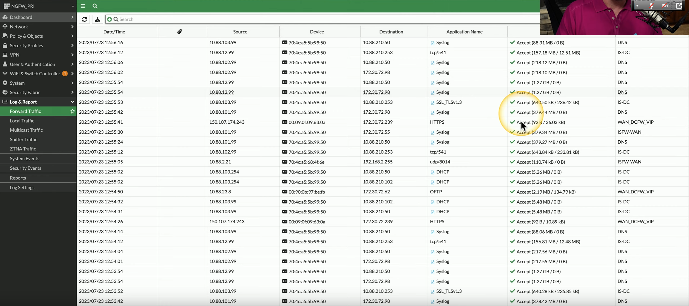
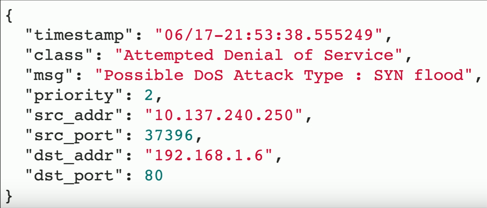
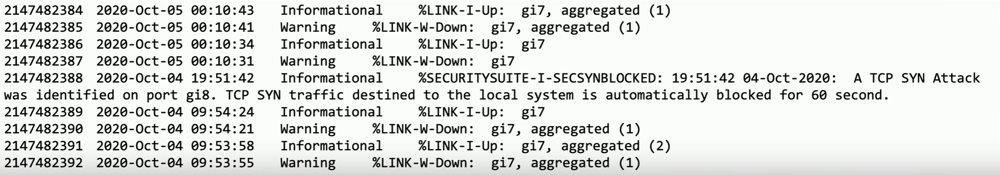

# Security Log Files
### Detailed security-related information
- Blocked and allowed traffic flows
- Exploit attempts
- Blocked URL categories
- DNS sinkhole traffic
### Critical security information
- Documentation of every traffic flow
- Summary of attack info
- Correlate with other logs
# Firewall Logs
### Traffic flows through the firewall
- Source/destination IP, port numbers, disposition
### NGFW
- Logs the application used, URL filtering categories, anomalies and suspicious data
### Example NGFW Logs

# Application Logs
### Specific to the application
- Information varies widely
### Windows
- Event Viewer/Application Log
### Linux/macOS
- /var/log
### Parse the log details on the SIEM
- Filter out unneeded info
# Endpoint Logs
### Attackers often gain access to endpoints
- Phones, laptops, tablets, desktops, servers, etc.
### There's a lot of data on the endpoint
- Logon events
- Policy changes
- System events
- Processes
- Account management
- Directory services
- Etc.
### Use with correlation of security events
- Combine IPS events with endpoint status
# OS-specific security logs
### OS security events
- Monitoring apps
- Brute force, file changes
- Authentication details
### Find problems before they happen
- Brute force attacks
- Disabled services
### May require filtering
- Don't forward everything
# IPS/IDS Logs
### Usually integrated into an NGFW
### Logs contain information about predefined vulnerabilities
- Known OS vulnerabilities, generic security events
### Common data points
- Timestamp
- Type or class of attack
- Source and destination IP
- Source and destination port
### Example Log from Snort (open source IPS)

# Network Logs
### Switches, routers, access points, VPN concentrators
- And other infrastructure devices
### Network changes
- Routing updates
- Authentication issues
- Network security issues
### Example Log

- This log shows there is an informational entry that shows a TCP SYN attack was identified on port gigabit 8
- We can see that the traffic destined to the local system has been automatically blocked for 60 seconds
# Metadata
### Metadata
- Data that described other data sources
### Email
- Header details, sending servers, destination address
### Mobile
- Type of phone, GPS coordinates
### Web
- OS, browser type, IP address
### Files
- Name, address, phone number, title
# Vulnerability Scans
### Lack of security controls
- No firewall
- No AV
- No anti-spyware
### Misconfigurations
- Open shares
- Guest access
### Real vulnerabilities
- Especially newer ones
- Occasionally the old ones
# Automated Reports
### Most SIEMs include a report generator
- Automate common security reports
### May be easy or complex to create
- The SIEM may have its own report generator
- 3rd party report generators may be able to access the database
### Requires human intervention
- Someone has to read the reports
### These can be involved to create
- Huge data storage and extensive processing time
# Dashboards
### Real-time status information
- Get summaries on a single screen
### Add or remove information
- Most SIEMs and reporting systems allow for customization
### Shows the most important data
- Not designed for long-term analysis
# Packet Captures
### Solve complex application issues
- Get into the details
### Gathers packets on the network
- Or in the air
- Sometimes built into the device
### View detailed traffic information
- Identify unknown traffic
- Verify packet filtering and security controls
- View a plain-language description of the application data