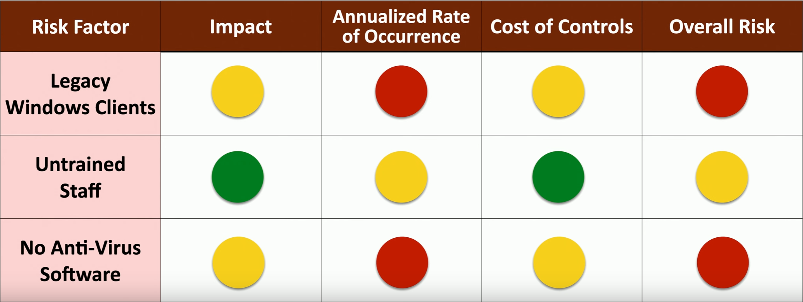

# Qualitative Risk Assessment
### Identify significant risk factors
- Ask opinions about the significance
- Display visually with traffic light grid or similar method

# Quantitative Risk Assessment
### ARO (Annualized Rate of Occurrence)
- How likely is it that a hurricane will hit? In Montana? In Florida?
### Asset Value (AV)
- The value of the asset to the organization
- Includes the cost of the asset, the effect on company sales, potential regulatory fines, etc.
### Exposure Factor (EF)
- The percentage of the value lost due to an incident
- Losing a quarter of the value is .25
- Losing the entire asset is 1.0
### SLE (Single Loss Expectancy)
- What is the monetary loss if a single event occurs?
- Asset Value (AV) x Exposure Factor (EF)
- Laptop stolen = $1,000 (AV) x 1.0 (EF) = $1,000 (SLE)
### ALE (Annualized Loss Expectancy)
- Annualized Rate of Occurrence (ARO) x SLE
- Seven laptops stolen a year (ARO) x $1,000 (SLE) = $7,000
### The business impact can be more than monetary
- Quantitative vs. Qualitative
# Impact
### Life
- The most important consideration
### Property
- The risk to buildings and assets
### Safety
- Some environments are too dangerous to work
### Finance
- The resulting financial cost
# Likelihood and Probability
### Risk likelihood
- A qualitative measurement of risk
- Rare, possible, almost certain, etc.
### Risk probability
- A quantitative measurement of risk
- A statistical measurement
- Can be based on historical performance
### Often considered similar in scope
- Can be used interchangeably in casual conversation
# Risk Appetite & Tolerance
### Risk appetite
- A broad description of risk-taking deemed acceptable
- The amount of accepted risk before taking any action to reduce that risk
### Risk appetite posture
- Quantitative description for readiness to take risk
- Conservative, neutral, and expansionary
### Risk tolerance
- An acceptable variance (usually larger) from the risk appetite
### Risk appetite
- A highway's speed limit
- Government authorities have set the speed limit
- The limit is an acceptable balance between safety and convenience
### Risk tolerance
- Drivers will be ticketed when the speed limit is violated
- Ticketing usually occurs well above the posted limit
- this tolerance can change with road conditions, weather, traffic, etc.
# Risk Register

### Every project has a plan, but also has risk
- Identify and document the risk associated with each step
- Apply possible solutions to the identified risks
- Monitor the results
### Key risk indicators
- Identify risks that could impact the organization
### Risk owners
- Each indicator is assigned someone to manage the risk
### Risk threshold
- The cost of mitigation is at least equal to the value gained by mitigation