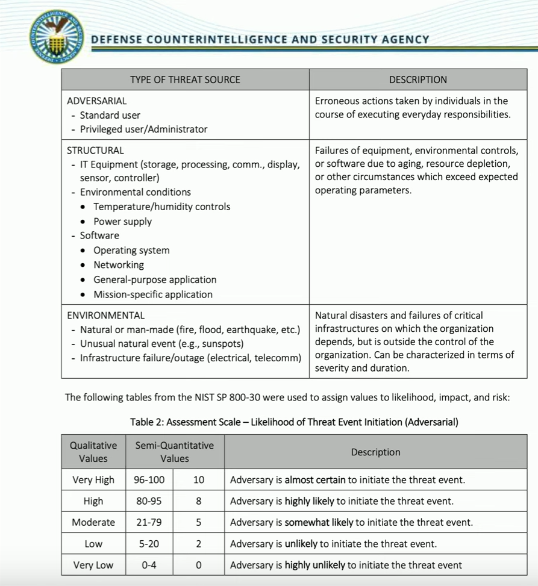

# Risk Management Strategies
### Transfer
- Move the risk to another party
- Buy some cybersecurity insurance
### Accept
- A business decision to take the risk and decide how they want to handle it
- This is often the usual course
### Accept with exemption
- A security policy or regulation cannot be followed
- May be based on available security controls, size of the organization, total assets, etc.
- Exemption may need approval
- Internal security policies are not applied
- Monthly security updates must be applied within 3 calendar days
- The monthly updates cause a critical software package to crash
- An exception is made to the update timeframe
### Avoid
- Stop participating in a high-risk activity
- This effectively removes the risk
### Mitigate
- Decrease the risk level
- Invest in security systems
# Risk Reporting
### A formal document
- Identifies risks
- Detailed information for each risk
### Usually created for senior management
- Make decisions regarding resources, budgeting, additional security tasks
### Commonly includes critical and emerging risks
- The most important considerations
### Example
