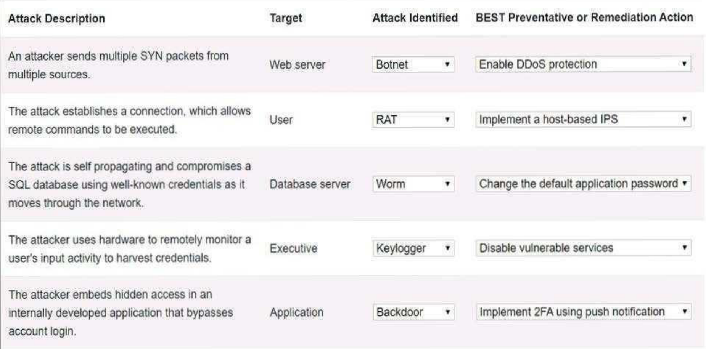

# SY0-701 Exam Dump
### Question 1
- *Which of the following threat actors is the most likely to be hired by a foreign government to attack critical systems located in other countries?*
- My answer: **C. Organized Crime**
- Correct!
### Question 2
- *Which of the following is used to add extra complexity before using a one-way data transformation algorithm?*
- My answer: A. Key Stretching
- Wrong, correct answer: **D. Salting**
### Question 3
- *An employee clicked a link in an email from a payment website that asked the employee to update contact information. The employee entered the log-in information but received a “page not found” error message. Which of the following types of social engineering attacks occurred?*
- My answer: **D. Phishing**
- Correct!
### Question 4
- *An enterprise is trying to limit outbound DNS traffic originating from its internal network. Outbound DNS requests will only be allowed from one device with the IP address 10.50.10.25. Which of the following firewall ACLs will accomplish this goal?*
- My answer: D. `Access list outbound permit 10.50.10.25320.0.0.0/0 port 53 Access list outbound deny 0.0.0.0.0.0.0.0.0/0 port 53`
- Correct!
### Question 5
- *A data administrator is configuring authentication for a SaaS application and would like to reduce the number of credentials employees need to maintain. The company prefers to use domain credentials to access new SaaS applications. Which of the following methods would allow this functionality?*
- My answer: **A. SSO**
- Correct!
### Question 6
- *Which of the following scenarios descrives a possible business email compromise attack?*
- My answer: C. A service desk employee receives an email from the HR director askinng for log-in credentials to a cloud administrator account
- Wrong, correct answer: **A. An employee receives a gift card request in an email that has an executives's name in the display field of the email**
### Question 7
- *A company prevented direct access from the database administrators’ workstations to the network segment that contains database servers. Which of the following should a database administrator use to access the database servers?*
- My answer: **A. Jump server**
- Correct!
### Question 8
- *An organization’s internet-facing website was compromised when an attacker exploited a buffer overflow. Which of the following should the organization deploy to best protect against similar attacks in the future?*
- My answer: C. TLS
- Wrong, correct answer: **B. WAF (Web Access Firewall)**
### Question 9
- *An administrator notices that several users are logging in from suspicious IPaddresses. After speaking with the users, the administrator determines that the employees were not logging in from those IP addresses and resets the affected users’ passwords. Which of the following should the administrator implement to prevent this type of attack from succeeding in the future?*
- My answer: **A. MFA**
- Correct!
### Question 10
- My answers: **C. Impersonation & E. Smishing**
- Correct!
### Question 11
- My answers: C. Issue a general email warning to the company & E. Conduct a forensic investigation on the CEO's phone
- Wrong, correct answers: **B. Add a smishing exercise to the annual company's training & C. Issue a general email warning to the company**
### Question 12
- My answer: **A. A thorough analysis of the supply chain**
### Question 13
- My answer: **A. Rules of engagement**
### Question 14
- My answer: **A. Active**
### Question 15
- My answer: C. RPO
- Wrong, correct answer: **B. DRP (Disaster Recvoery Plan)**
### Question 16
- My answer: **D. Side loading**
### Question 17
- My answer: **A. Password spraying**
### Question 18
- My answer: C. Adaptive identity
- Wrong, correct answer: **D. Threat scope reduction**
### Question 19
- My answer: **B. Jump server**
### Question 20
- My answer: D. :443
- Wrong, correct answer: **B. http://**
### Question 21
- My answer: **B. access-list inbound deny ig source 10.1.4.9/32 destination 0.0.0.0/0**
### Question 22
- My answer: **A. Implementing a bastion host**
### Question 23
- My answer: B. IPS/IDS
- Wrong, correct answer: **D. Endpoint**
### Question 24
- My answer: **D. Threat hunting**
### Question 25
- My answer: **B. Transfer**
### Question 26
- My answer: **C. Full disk**
### Question 27
- My answer: **D. Preventive**
### Question 28
- My answer: **D. Least privilege**
### Question 29
- My answer: D. Risk analysis
- Wrong, correct answer: **C. Risk register**
### Question 30
- My answer: **D. Change management procedure**
### Question 31
- My answer: **B. Bug bounty**
### Question 32
- My answer: **C. Nation-state**
### Question 33
- My answer: **D. SQL Injection**
### Question 34
- My answer: **B. Intellectual property**
### Question 35
- My answers: **A. If a security incident occurs on the device, the correct employee can be notified & F. Company data can be accounted for when the employee leaves the organization**
### Question 36
- My answer: **C. Modify the content of recurring training**
### Question 37
- My answer: **D. Dashboard**
### Question 38
- My answer: **D. A rootkit was deployed**
### Question 39
- My answer: C. Cloud provider
- Wrong, correct answer: **A. Client**
### Question 40
- My answer: **D. SOW (Statement of Work)**
### Question 41
- My answer: **C. Input validation**
### Question 42
- My answer: **A. Ease of recovery, E. Attack surface**
### Question 43
- My answer: **C. Create a change control request**
### Question 44
- My answer: **D. To prevent future incidents of the same nature**
### Question 45
- My answer: **A. Fines**
### Question 46
- My answer: **A. Capacity planning**
### Question 47
- My answer: **C. Geolocation policy**
### Question 48
- My answer: **A. Firmware version**
### Question 49
- My answer: **B. Testing the policy in a non-production environment before enabling the policy in the production network**
### Question 50
- My answer: A
- Wrong, correct answer: **C. Cold site**
### Question 51
- My answer: **B. Sanitization**
### Question 52
- My answer: **C. Sensitive**
### Question 53
- My answer: **A. Local data protections regulations**
### Question 54
- My answer: **B. Application allow list**
### Question 55
- My answer: **D. Red**
### Question 56
- My answer: **B. Performing code signing on company-developed software**
### Question 57
- My answer: **A. Honey pot**
### Question 58
- My answer: **A. Analysis**
### Question 59
- My answer: **C. Rescan the network**
### Question 60
- My answer: **D. Insider threat**
### Question 61
- My answer: **B. Non-repudiation**
### Question 62
- My answer: **A. Automation**
### Question 63
- My answer: **D. DLP (Data Loss Prevention)**
### Question 64
- My answer: **C. Input validation**
### Question 65
- My answer: D. Create additional training for users to recognize the signs of phishing attempts
- Wrong, correct answer: **C. Update the EDR policies to block automatic execution of downloaded programs**
### Question 66
- My answer: **A. Compensating control**
### Question 67
- My answer: **D. User provisioning script**
### Question 68
- My answer: **C. Detective**
### Question 69
- My answer: **A. Serverless framework**
### Question 70
- My answer: **A. Tuning**
### Question 71
- My answer: **C. An attacker is attempting to brute force jsmith's account**
### Question 72
- My answer: A. Clustering servers
- Wrong, correct answer: **B. Geographic dispersion**
### Question 73
- My answer: **D. Jailbreaking**
### Question 74
- My answer: **C. ARO**
### Question 75
- My answer: **A. Reporting phishing attempts or other suspicious activities**
### Question 76
- My answers:
	- Botnet & Enable DDoS Protection
	- RAT & Disable remote access services
	- Worm & Change the default system password
	- Keylogger & Implement a host-based IPS
	- Backdoor & Conduct a code review
- Wrong, correct answers:

